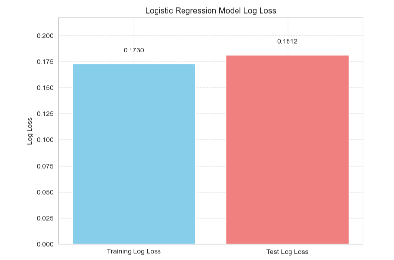
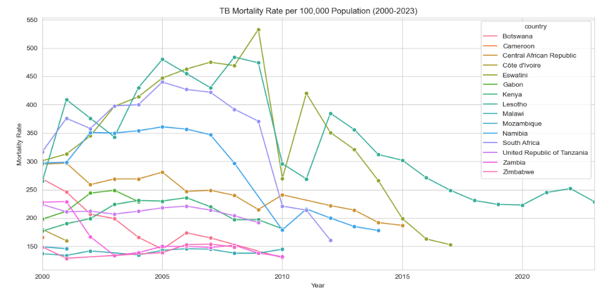
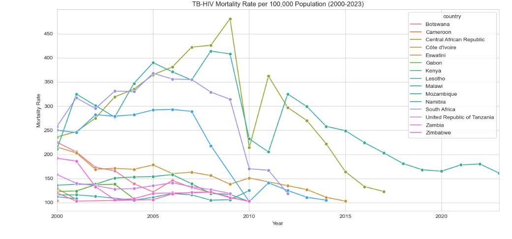
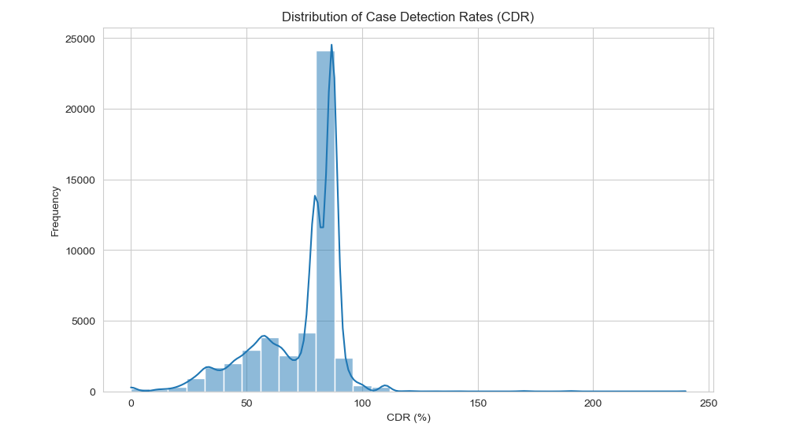

# TUBERCULOSIS RISK ANALYSIS 

## OVERVIEW 

Tuberculosis (TB) is an infectious disease caused by bacteria that most often affects the lungs. It spreads through the air when people with TB cough, sneeze or spit. It is preventable and curable.

Approximately one-quarter of the world's population carries the TB bacteria, with only 5-10% of those infected developing active TB disease. Infected individuals without symptoms cannot transmit the disease. TB disease is typically treated with antibiotics and can be fatal if left untreated. 
In some countries, the Bacille Calmette-Guérin (BCG) vaccine is administered to infants and young children, effectively preventing TB-related deaths and safeguarding them from severe forms of the disease.

## PROBLEM STATEMENT

TB is one of the major leading causes of death in the world from a single infectious agent, following three years in which it was replaced by coronavirus disease (COVID-19).

It was also the leading killer of people with HIV and a major cause of deaths related to antimicrobial resistance. It is present in all countries and age groups. It is therefore a disease of public health importance and there have been efforts made to combat the disease globally which has saved an estimated 79 million lives since the year 2000.

This project aims to analyze the burden of TB in high risk WHO regions in terms of incidence and mortality rates.
Visualise the health systems performance in response to TB and finally build a logistic model to predict case detection rate for the disease. 
The insights drawn from the analysis would help inform public health decision making in policies aimed at preventing TB in populations.  

## DATA UNDERSTANDING 

The datasets used in the project are sourced from World Health Organization (WHO) https://www.who.int/data/gho/data/themes/tuberculosis.

They include three csv files: MDR_RR_TB_burden_estimates_2025-06-06, TB_burden_countries_2025-06-07 and TB_data_dictionary_2025-06-06. 

The files contains data reported by WHO and estimates of tuberculosis burden generated by WHO for the Global tuberculosis report.The report provides a comprehensive and up-to-date assessment of the TB epidemic, and of progress in prevention, diagnosis and treatment of the disease at global, regional and country levels.

The data dictionary provides description of the data variables in the other two csv files which is also provided by the text description file.

The MDR_RR_TB_burden_estimates_2025-06-06 file contains data on MDR-TB which is a a form of TB caused by bacteria that do not respond to isoniazid and rifampicin, the two most effective first-line TB drugs.

The TB_burden_countries_2025-06-07 file captures the overall burden estimates of disease in the WHO regions. 

## OBJECTIVES
The project aims to answer the following questions;

#### 1. What are the countries in the WHO region that have a high burden of TB both in terms of mortality and incidence?
The WHO guidelines categorize countries that have an incidence of greater than 100 per 100 000 population as high risk regions.

From there we can then proceed to visualize the countries' trends in disease occurence for all the years to see how health efforts have helped in combating the disease.

#### 2. How is the health system performance in diagnosing TB?
We have data on case detection including for Lab-confirmed resistant TB. This will allow us to identify underdiagnosis of the disease and data quality of cases reported.

#### 3. What is the accuracy of test in detecting TB cases?
Is the test sensitive enough to detect less false negative cases?

# RESULTS

#### 1. Incidence levels in different regions 
We feature engineered the high risk column to categorise countries with high risk (1) and low risk countries(0) and built a model that can be used to distinguish the two regions. 
From the analysis;

In the log loss bar plot,the test log loss is only marginally higher than the training log loss suggests that the model is not significantly overfitting the training data.
From the model,The model achieves an overall accuracy of 85% and a strong ROC-AUC of 0.87, indicating excellent ability to distinguish between high-risk and not-high-risk cases.

#### 2. Mortality rates in different regions

From the plots, both show broadly similar trends, with many countries experiencing a peak in mortality rates in the early to mid-2000s, followed by a general decline. This suggests that the decline in overall TB mortality is significantly influenced by the reduction in TB-HIV co-mortality.

The significant drops observed in overall TB mortality in these countries from the mid-2000s onwards are mirrored by similar sharp declines in TB-HIV mortality, likely due to the scale-up of antiretroviral therapy (ART) and TB/HIV collaborative activities. This suggests that effective HIV treatment and prevention directly contribute to reducing TB mortality.

#### 3. Disease detection accuracy

## RECOMMENDATIONS

#### The logistic model works well in identifying high risk and non high risk regions 
The model with an an overall accuracy of 85% and a strong ROC-AUC of 0.87 works well in distinguishing the two classes and can be used in public health to drive intervention efforts to these countries.

#### TB and HIV are co-morbid
From the visualizations, it is clear that people with HIV are more susceptible to getting TB due to weak immunity. The two are a lethal combination each speeding the other's progress.

#### TB case detection 

## NEXT STEPS

Further analysis on:
#### Health system performance 
Using variables like bacteriologically confirmed TB cases, case detection and casr fatality rate, we could give insights in to the health system performance in diadnosis of TB.

#### Use the mortality rates to estimate imapct of TB.

#### Identify treatment coverage areas 
Using the case detection rate we can map out the treatment coverage

